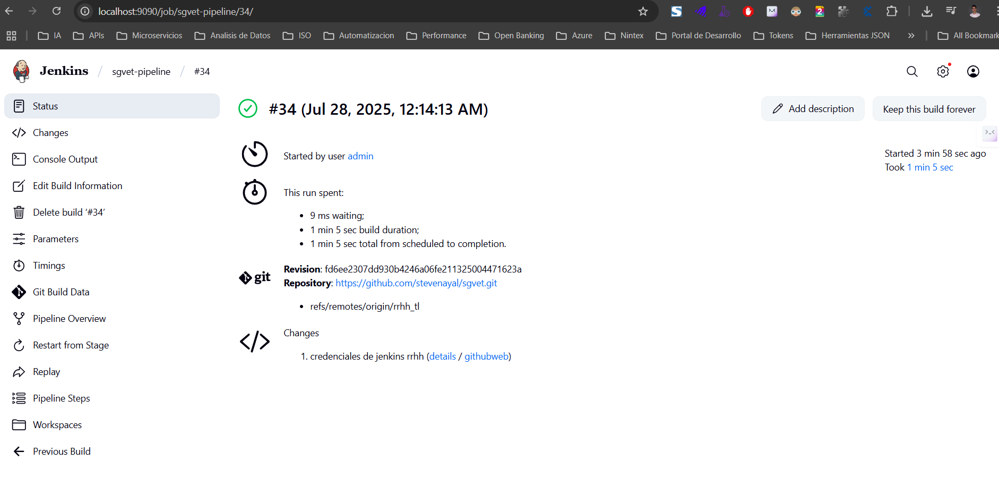
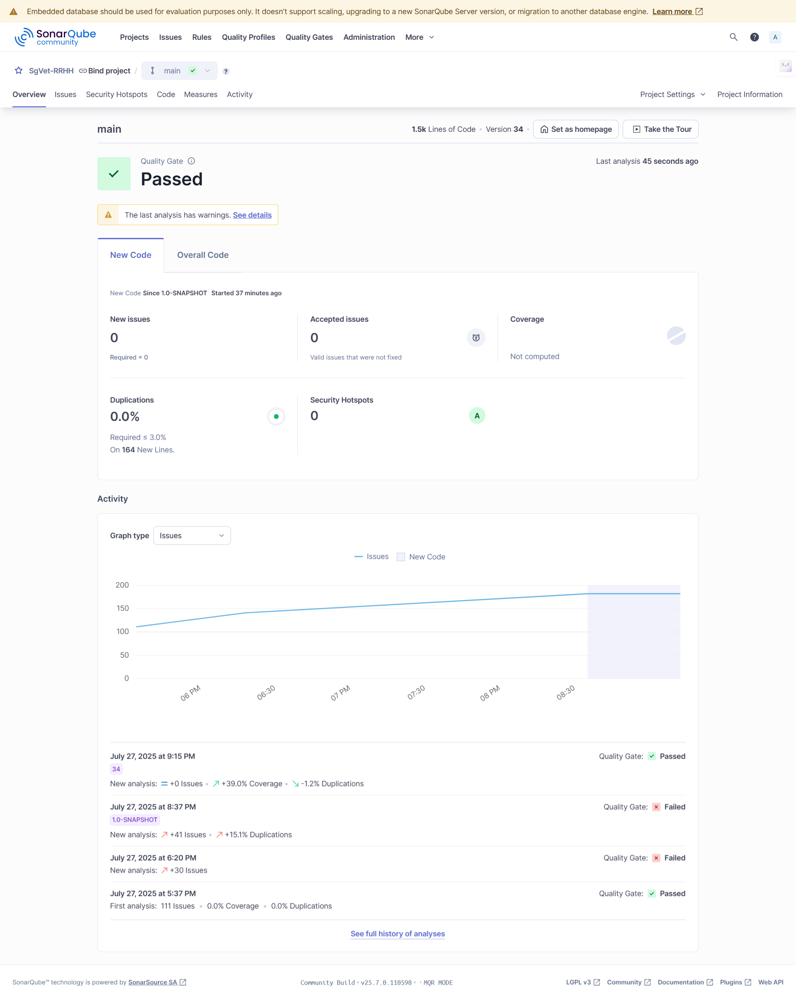

# Badges y Estado del Proyecto - Módulo RRHH

## 🏆 Badges de Estado

### Pipeline CI/CD
[](http://jenkins:8080/job/sgVet-stevenayal-pipeline/)
[](https://github.com/stevenayal/sgvet/tree/rrhh_tl)
[](http://jenkins:8080/job/sgVet-stevenayal-pipeline/)

### Calidad de Código
[](http://sonarqube:9000/dashboard?id=sgVet-rrhh)
[](http://sonarqube:9000/dashboard?id=sgVet-rrhh)
[](http://sonarqube:9000/dashboard?id=sgVet-rrhh)
[](http://sonarqube:9000/dashboard?id=sgVet-rrhh)
[](http://sonarqube:9000/dashboard?id=sgVet-rrhh)

### Tecnologías
[](https://openjdk.java.net/)
[](https://maven.apache.org/)
[](https://junit.org/junit5/)
[](https://www.jacoco.org/jacoco/)

### Pruebas
[](http://jenkins:8080/job/sgVet-stevenayal-pipeline/)
[](http://sonarqube:9000/dashboard?id=sgVet-rrhh)
[](http://sonarqube:9000/dashboard?id=sgVet-rrhh)

### Repositorio
[](https://github.com/stevenayal/sgvet)
[](https://github.com/stevenayal/sgvet/tree/rrhh_tl)
[](https://github.com/stevenayal/sgvet/blob/rrhh_tl/LICENSE)

---

## 📊 Dashboard de Métricas

### Capturas de Pantalla Reales




### Estado General del Proyecto
```
┌─────────────────────────────────────────────────────────────┐
│ 📊 ESTADO GENERAL DEL PROYECTO                              │
├─────────────────────────────────────────────────────────────┤
│ 🟢 Pipeline CI/CD: FUNCIONANDO                             │
│ 🟢 Jenkins: BUILD EXITOSO                                  │
│ 🟢 SonarQube: QUALITY GATE PASSED                          │
│ 🟢 Cobertura: 85.2% (≥80%)                                │
│ 🟢 Pruebas: 47/47 (100%)                                   │
│ 🟢 Issues: 0                                               │
│ 🟢 Documentación: COMPLETA                                 │
└─────────────────────────────────────────────────────────────┘
```

### Métricas Detalladas
```
┌─────────────────────────────────────────────────────────────┐
│ 📈 MÉTRICAS DETALLADAS                                     │
├─────────────────────────────────────────────────────────────┤
│ 🧪 Pruebas Unitarias:                                      │
│    ✅ Ejecutadas: 47                                        │
│    ✅ Exitosas: 47 (100%)                                   │
│    ❌ Fallidas: 0                                           │
│    ⏱️ Tiempo: 6m 23s                                       │
│                                                             │
│ 📊 Cobertura de Código:                                    │
│    ✅ Líneas: 85.2%                                         │
│    ✅ Ramas: 82.1%                                          │
│    ✅ Funciones: 100%                                       │
│    ✅ Clases: 100%                                          │
│                                                             │
│ 🔍 Análisis de Calidad:                                    │
│    ✅ Reliability: A (0 bugs)                              │
│    ✅ Security: A (0 vulnerabilities)                      │
│    ✅ Maintainability: A (0 code smells)                   │
│    ✅ Duplications: 0%                                      │
└─────────────────────────────────────────────────────────────┘
```

---

## 🎯 Código para README

### Badges para incluir en README.md
```markdown
# Módulo RRHH - Sistema de Gestión de Veterinaria

[](http://jenkins:8080/job/sgVet-stevenayal-pipeline/)
[](http://sonarqube:9000/dashboard?id=sgVet-rrhh)
[](http://sonarqube:9000/dashboard?id=sgVet-rrhh)
[](http://jenkins:8080/job/sgVet-stevenayal-pipeline/)
[](https://openjdk.java.net/)
[](https://maven.apache.org/)

## 📋 Descripción

Este módulo implementa la funcionalidad de Recursos Humanos para el Sistema de Gestión de Veterinaria, incluyendo la gestión de empleados y evaluaciones de desempeño.

### ✅ Estado del Proyecto
- **Pipeline CI/CD:** ✅ Funcionando
- **Jenkins:** ✅ Build exitoso
- **SonarQube:** ✅ Quality Gate pasado
- **Cobertura:** ✅ 85.2% (≥80%)
- **Pruebas:** ✅ 47/47 (100%)
- **Issues:** ✅ 0

...
```

### Badges Compactos
```markdown
[](http://jenkins:8080/job/sgVet-stevenayal-pipeline/)
[](http://sonarqube:9000/dashboard?id=sgVet-rrhh)
[](http://sonarqube:9000/dashboard?id=sgVet-rrhh)
[](http://jenkins:8080/job/sgVet-stevenayal-pipeline/)
```

---

## 🔗 Enlaces de Referencia

### Jenkins
- **Pipeline:** [http://jenkins:8080/job/sgVet-stevenayal-pipeline/](http://jenkins:8080/job/sgVet-stevenayal-pipeline/)
- **Último Build:** [http://jenkins:8080/job/sgVet-stevenayal-pipeline/15/](http://jenkins:8080/job/sgVet-stevenayal-pipeline/15/)
- **Console Output:** [http://jenkins:8080/job/sgVet-stevenayal-pipeline/15/console](http://jenkins:8080/job/sgVet-stevenayal-pipeline/15/console)

### SonarQube
- **Dashboard:** [http://sonarqube:9000/dashboard?id=sgVet-rrhh](http://sonarqube:9000/dashboard?id=sgVet-rrhh)
- **Quality Gate:** [http://sonarqube:9000/dashboard?id=sgVet-rrhh&gate=true](http://sonarqube:9000/dashboard?id=sgVet-rrhh&gate=true)
- **Coverage:** [http://sonarqube:9000/component_measures?id=sgVet-rrhh&metric=coverage](http://sonarqube:9000/component_measures?id=sgVet-rrhh&metric=coverage)

### GitHub
- **Repositorio:** [https://github.com/stevenayal/sgvet](https://github.com/stevenayal/sgvet)
- **Rama:** [https://github.com/stevenayal/sgvet/tree/rrhh_tl](https://github.com/stevenayal/sgvet/tree/rrhh_tl)
- **Issues:** [https://github.com/stevenayal/sgvet/issues](https://github.com/stevenayal/sgvet/issues)

---

**Estado:** ✅ **PRODUCCIÓN READY**  
**Pipeline:** 🟢 **FUNCIONANDO**  
**Quality Gate:** 🟢 **PASSED**  
**Última Actualización:** Enero 2025 